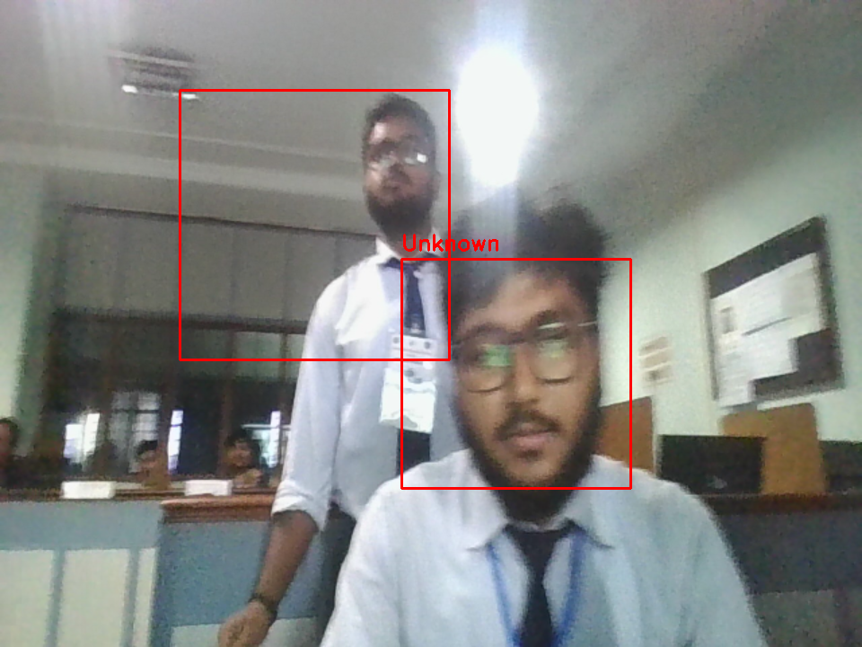

# SecureVision – Face Recognition Attendance & Security System

SecureVision is a Python-based computer vision system designed for smart attendance tracking and real-time security monitoring.

The system uses face recognition to identify authorized individuals and logs attendance automatically. If an unknown person appears, it triggers a security alert and records the event.

This project was developed during a hackathon by Team **TBC (TheBroCoders)** and won the competition.

---

# Features

* Face detection using Haar Cascade
* Face recognition using LBPH algorithm
* Employee registration using camera
* Automatic attendance logging with timestamp
* Unauthorized person detection and alerts
* Event logging using SQLite database
* Snapshot capture during security breaches
* Real-time GUI dashboard using Tkinter

---

# Technology Stack

### Language

* Python

### Libraries

* OpenCV
* NumPy
* Pillow
* Tkinter
* SQLite3

### Concepts

* Computer Vision
* Face Recognition
* Image Processing
* Event Logging
* GUI Development

---

# Project Structure

```id="m3n9l8"
secure-vision/
│
├── gui.py
├── attendance.py
├── database.py
├── trainer.py
├── utils.py
│
├── dataset/
├── snapshots/
│
├── trainer.yml
├── haarcascade_frontalface_default.xml
│
├── attendance_log.csv
├── faceguard_events.db
│
└── README.md
```

---

# How the System Works

1. Register employees using the camera.
2. Face images are stored in the dataset folder.
3. Train the model using the training script.
4. Launch the GUI dashboard.
5. The system detects and recognizes faces in real time.
6. Authorized users are marked present.
7. Unknown users trigger alerts and event logs.

---

# Installation

Clone the repository:

```bash id="sdc3xv"
git clone https://github.com/yourusername/secure-vision.git
```

Go to the project folder:

```bash id="g82mjv"
cd secure-vision
```

---

# Setup Using Virtual Environment

Create virtual environment:

```id="2gx3p3"
python -m venv venv
```

Activate virtual environment:

### Windows

```id="l5xq4b"
venv\Scripts\activate
```

### Linux / Mac

```id="p1v3kz"
source venv/bin/activate
```

---

# Install Dependencies

```id="6d7r9k"
pip install opencv-python
pip install opencv-contrib-python
pip install numpy
pip install pillow
```

---

# Train the Model

After registering users:

```id="y9v8jc"
python trainer.py
```

This will generate:

```id="m5t2xk"
trainer.yml
```

---

# Run the Application

```id="9x7d2p"
python gui.py
```

The SecureVision dashboard will open and start the camera.

---

# Usage

* Register Employee → Capture face data
* Train Model → Generate recognition model
* Start System → Detect and recognize faces
* Monitor → View events and alerts in dashboard

---

# Example Output

Authorized Access

```id="q8x2dn"
Name: Arijeet
Status: Authorized
Camera: CAM 3
```
<p align="center">
  
</p>
Unauthorized Detection

```id="7c9w1m"
Unknown person detected
Security alert triggered
Snapshot saved
```

---

# Future Improvements

* Deep learning based recognition (FaceNet / DeepFace)
* Multi-camera support
* Web-based dashboard
* Email or mobile alerts
* Cloud storage integration

---

# Team

**TBC (TheBroCoders)**

This project was developed during a hackathon and won the competition. It demonstrates the application of computer vision for real-time attendance tracking and security monitoring.

---

# License

This project is open source and intended for educational purposes.
